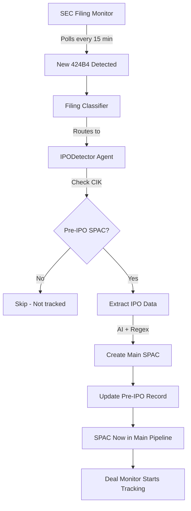

# IPO Detector Agent Implementation

**Date:** October 10, 2025
**Status:** ✅ Complete - Real-time event-driven IPO graduation now enabled

---

## Overview

Implemented real-time detection and graduation of pre-IPO SPACs when they file 424B4 (final prospectus = IPO closed).

Previously, IPO graduation only happened via **daily batch job**. Now it's **event-driven** via the SEC filing monitor and orchestrator.

---

## Architecture

### Flow: 424B4 Filing → SPAC Graduation

```
SEC Filing Monitor (polls every 15 min)
    ↓ Detects 424B4 filing
    ↓
Filing Classifier (in orchestrator)
    ↓ Routes to IPODetector agent
    ↓
IPODetector Agent
    ├─ Checks if CIK matches tracked pre-IPO SPAC
    ├─ Extracts IPO data (AI + regex hybrid)
    │  ├─ IPO proceeds
    │  ├─ Unit structure
    │  ├─ Deadline months
    │  ├─ Shares issued
    │  ├─ Trust per unit
    │  └─ Warrant terms
    ├─ Creates new SPAC in main database
    │  └─ deal_status = 'SEARCHING'
    └─ Updates pre-IPO record
       └─ filing_status = 'Closed'
```

---

## Files Created/Modified

### New Files

1. **`/home/ubuntu/spac-research/agents/ipo_detector_agent.py`**
   - IPODetector agent class
   - Inherits from BaseAgent (async)
   - AI-enhanced 424B4 extraction (same pattern as other agents)
   - Graduates pre-IPO SPACs to main pipeline

2. **`/home/ubuntu/spac-research/pre_ipo_ipo_close_monitor_ai.py`**
   - AI-enhanced version of old monitor
   - Used by daily batch job (backup/fallback)
   - Same extraction logic as IPODetector agent
   - Modernized to match codebase patterns

### Modified Files

1. **`/home/ubuntu/spac-research/agent_orchestrator.py`**
   - Line 1159-1187: Implemented `_dispatch_ipo_detector()`
   - Line 878: Updated IPODetector description for AI routing
   - Line 696: IPODetector already registered (now functional)

2. **`/home/ubuntu/spac-research/daily_spac_update.sh`**
   - Line 64: Updated to use AI-enhanced monitor
   - Changed from `pre_ipo_ipo_close_monitor.py` → `pre_ipo_ipo_close_monitor_ai.py`

---

## Key Features

### 1. AI-Enhanced Extraction
Uses hybrid regex + AI approach (consistent with other scrapers):

```python
# Try regex first (fast, common patterns)
data = self._extract_with_regex(text)

# Use AI for missing fields
if AI_AVAILABLE:
    if not data.get('ipo_proceeds') or not data.get('unit_structure'):
        ai_data = self._extract_with_ai(text)
        # Merge AI results
```

**AI extracts:**
- IPO proceeds (e.g., "$200M")
- Unit structure (e.g., "1 share + 1/3 warrant")
- Deadline months (typically 18-24)
- Shares issued
- Trust per unit ($10.00)
- Warrant exercise price ($11.50)
- Warrant expiration years (5)

### 2. Pre-IPO → Main Pipeline Graduation

When 424B4 detected:

**Pre-IPO Database:**
```python
pre_ipo_spac.filing_status = 'Closed'
pre_ipo_spac.ipo_close_date = '2025-10-10'
pre_ipo_spac.moved_to_main_pipeline = True
```

**Main Database:**
```python
new_spac = SPAC(
    ticker='NEWT',
    deal_status='SEARCHING',  # Newly public!
    ipo_date='2025-10-10',
    deadline_date='2027-04-10',  # IPO date + deadline months
    # ... all IPO data extracted from 424B4
)
```

### 3. Dual Detection Modes

**Real-Time (Event-Driven):**
- SEC Filing Monitor detects 424B4 every 15 minutes
- Routes to IPODetector agent via orchestrator
- Immediate graduation to main pipeline

**Daily Batch (Backup):**
- Cron job at 9 AM daily
- Runs `pre_ipo_ipo_close_monitor_ai.py --commit`
- Catches any missed filings
- Same AI extraction logic

---

## SEC Filing Monitor Integration

### Filing Classifier (Line 214-219)

```python
elif filing_type in ['424B4', 'S-1']:
    return {
        'priority': 'MEDIUM',
        'agents_needed': ['IPODetector'],
        'reason': 'IPO filing - potential new SPAC'
    }
```

**Before:** IPODetector was placeholder (not implemented)
**After:** Fully functional agent with AI extraction

---

## Data Extracted from 424B4

| Field | Source | Example |
|-------|--------|---------|
| `ipo_proceeds` | AI + Regex | "$200M" |
| `unit_structure` | AI + Regex | "1 share + 1/3 warrant" |
| `deadline_months` | AI + Regex | 24 |
| `shares_issued` | AI | 20.0 (millions) |
| `trust_per_unit` | AI | 10.00 |
| `warrant_exercise_price` | AI | 11.50 |
| `warrant_expiration_years` | AI | 5 |
| `deadline_date` | Calculated | ipo_date + deadline_months |

---

## Testing

### Manual Test
```bash
# Test with specific pre-IPO SPAC
cd /home/ubuntu/spac-research
python3 agents/ipo_detector_agent.py

# Or test via orchestrator
python3 agent_orchestrator.py --test-filing <cik> 424B4
```

### Real-World Test
1. Add a pre-IPO SPAC to pre_ipo database with `filing_status='EFFECTIVE'`
2. When it files 424B4, SEC monitor will detect it
3. IPODetector agent will graduate it to main pipeline
4. Check logs: `logs/agent_orchestrator.log`

---

## Comparison: Old vs New

### Old Implementation (`archive/pre_ipo/pre_ipo_ipo_close_monitor.py`)

❌ **Manual BeautifulSoup + regex parsing**
❌ **Brittle pattern matching**
❌ **Limited data extraction**
❌ **Only batch mode (daily cron)**
❌ **Not integrated with orchestrator**

### New Implementation (`agents/ipo_detector_agent.py`)

✅ **AI-enhanced extraction (DeepSeek)**
✅ **Hybrid regex + AI (same as other agents)**
✅ **Comprehensive data extraction**
✅ **Real-time event-driven (15-min polling)**
✅ **Fully integrated with orchestrator**
✅ **Daily batch backup still available**

---

## Orchestration Flow



---

## Cron Backup Job

Daily at 9 AM (belt and suspenders):

```bash
# /home/ubuntu/spac-research/daily_spac_update.sh (Line 64)
python3 pre_ipo_ipo_close_monitor_ai.py --commit
```

**Purpose:**
- Catches any 424B4s missed by real-time monitor
- Handles SPACs added to pre-IPO pipeline between monitor runs
- Redundancy for critical graduation process

---

## Next Steps (Optional Enhancements)

1. **Notifications:** Send Telegram alert when pre-IPO SPAC graduates
2. **Metrics:** Track time from S-1 EFFECTIVE → 424B4 filing
3. **Validation:** Compare AI extraction vs manual review for accuracy
4. **Pre-fill:** Auto-populate expected tickers for newly graduated SPACs

---

## Learnings Applied

This implementation follows established patterns:

- **Learning #21:** Multi-format ticker discovery (applied to graduation)
- **Learning #22:** Component price validation (will apply after graduation)
- **Hybrid AI approach:** Regex first, AI for missing (like deal_announcement_scraper.py)
- **BaseAgent pattern:** Async can_process() + process() methods
- **State management:** Orchestrator tracks agent execution

---

*Last updated: October 10, 2025*
